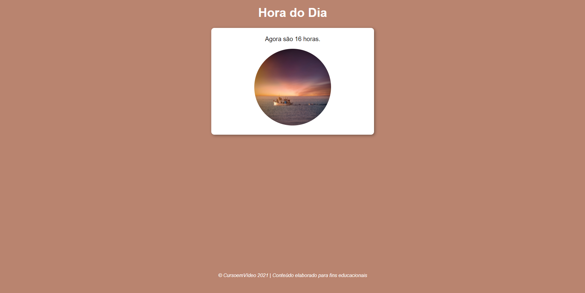

# Seletor de Hora e Período do dia 

## Descrição do Projeto 💻

O projeto visa a criação de uma aplicação que identifique o período e hora do dia automaticamente. De de acordo com o horário indicado a imagem e plano de fundo serão modificados dinamicamente.
Exercício prático desenvolvido como parte integrante do curso de JavaScript do Professor Gustavo Guanabara para o Curso em Vídeo.
Veja o conteúdo da aula no YouTube:

[Clique aqui](https://www.youtube.com/watch?v=UXSWgnbSHxs&list=PLHz_AreHm4dlsK3Nr9GVvXCbpQyHQl1o1&index=20).

### Status do Projeto 🚧 

Em desenvolvimento :warning:

### Começando 🏁

Para conseguir utilizar o template basta fazer o download do projeto ou clonar este repositório utilizando o Git em seu terminal.

### Observações 📌

No template temos a lógica criada e os campos definidos, mas sinta-se a vontade para fazer alterações.

### Pré-requisitos :large_orange_diamond:

Editor de texto de sua preferência, nesse projeto foi utilizado o [VSCode](https://code.visualstudio.com).

### Tecnologias ⚒️ 

As seguintes ferramentas foram usadas na construção do projeto:

- [JavaScript](https://developer.mozilla.org/pt-BR/docs/Web/JavaScript)
- [HTML](https://developer.mozilla.org/pt-BR/docs/Web/HTML)
- [CSS](https://developer.mozilla.org/pt-BR/docs/Web/CSS)

### Criado por:

Feito com ❤️ por Francislene Oliveira 👋🏽 Entre em contato!
 

### Licença

